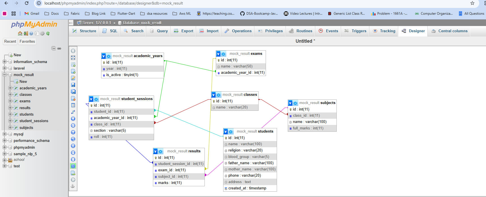

Perfect 👍
এই screenshot টা দেখে বলছি: **তোমার DB design 100% correct পথে আছে**।
এখন আমি তোমাকে **FULL, CLEAN, EASY documentation** দিচ্ছি—যেটা তুমি:

* Project report এ দিতে পারবে
* Teacher / viva বোর্ডকে explain করতে পারবে
* Future এ নিজে পড়লেও বুঝতে পারবে

আমি নিচে **৩টা জিনিস একসাথে দিচ্ছি**
1️⃣ Concept & explanation (সহজ ভাষায়)
2️⃣ Table-wise SQL (CREATE TABLE)
3️⃣ Sample INSERT data (real example)

---

# 📘 School Result Management System

## Complete Database Documentation

---

## 🔷 1. System Overview (High level)

এই system এমনভাবে design করা হয়েছে যেন:

* একজন student বহু বছর পড়তে পারে
* প্রতি বছর তার class, roll পরিবর্তন হতে পারে
* এক বছরে একাধিক exam থাকতে পারে
* Result history কখনো নষ্ট না হয়
* Future এ exam / class / subject change হলেও DB break না করে

👉 **Core idea**

> Student permanent,
> Academic year + class + roll = session,
> Exam = year-wise,
> Result = session + exam + subject

---

## 🔷 2. Entity Relationship (Conceptual)

```
students
   ↓
student_sessions
   ↓
results
   ↑
exams ── academic_years
   ↑
subjects ── classes
```

---

## 🔷 3. Table-wise Details

---

## 🟦 3.1 academic_years

### 📌 Purpose

School-এর academic year manage করা (2024, 2025, 2026…)

### 📄 Table

```sql
CREATE TABLE academic_years (
  id INT AUTO_INCREMENT PRIMARY KEY,
  year INT NOT NULL,
  is_active TINYINT(1) DEFAULT 0
);
```

### 📥 Sample Data

```sql
INSERT INTO academic_years (year, is_active) VALUES
(2024, 0),
(2025, 1);
```

---

## 🟦 3.2 classes

### 📌 Purpose

School-এর class list store করা

### 📄 Table

```sql
CREATE TABLE classes (
  id INT PRIMARY KEY,
  name VARCHAR(20) NOT NULL
);
```

### 📥 Sample Data

```sql
INSERT INTO classes (id, name) VALUES
(54, 'Play'),
(55, 'Nursery'),
(56, 'One'),
(57, 'Two'),
(58, 'Three'),
(59, 'Four'),
(60, 'Five');
```

---

## 🟦 3.3 students (Permanent Information)

### 📌 Purpose

Student-এর personal info (never changes)

> ❌ class, roll, year এখানে রাখা হয় না

### 📄 Table

```sql
CREATE TABLE students (
  id INT AUTO_INCREMENT PRIMARY KEY,
  name VARCHAR(100),
  religion VARCHAR(20),
  blood_group VARCHAR(5),
  father_name VARCHAR(100),
  mother_name VARCHAR(100),
  phone VARCHAR(20),
  address TEXT,
  created_at TIMESTAMP DEFAULT CURRENT_TIMESTAMP
);
```

### 📥 Sample Data

```sql
INSERT INTO students
(name, religion, blood_group, father_name, mother_name, phone, address)
VALUES
('Samina', 'Islam', 'O+', 'Abdul Karim', 'Rahima Begum', '01799999999', 'Sylhet');
```

---

## 🟦 3.4 student_sessions ⭐ (MOST IMPORTANT)

### 📌 Purpose

একজন student কোন **academic year-এ কোন class, roll, section**-এ পড়ছে

> student_session = student + year + class

### 📄 Table

```sql
CREATE TABLE student_sessions (
  id INT AUTO_INCREMENT PRIMARY KEY,
  student_id INT,
  academic_year_id INT,
  class_id INT,
  section VARCHAR(5),
  roll INT,
  FOREIGN KEY (student_id) REFERENCES students(id),
  FOREIGN KEY (academic_year_id) REFERENCES academic_years(id),
  FOREIGN KEY (class_id) REFERENCES classes(id)
);
```

### 📥 Sample Data

```sql
INSERT INTO student_sessions
(student_id, academic_year_id, class_id, section, roll)
VALUES
(1, 1, 58, 'A', 5);  -- Samina, Class Three, 2024
```

---

## 🟦 3.5 exams (Year-wise)

### 📌 Purpose

একটি academic year-এ কোন কোন exam হবে

> ✔ Exam class-wise না
> ✔ Exam year-wise

### 📄 Table

```sql
CREATE TABLE exams (
  id INT AUTO_INCREMENT PRIMARY KEY,
  name VARCHAR(50),
  academic_year_id INT,
  FOREIGN KEY (academic_year_id) REFERENCES academic_years(id)
);
```

### 📥 Sample Data

```sql
INSERT INTO exams (name, academic_year_id) VALUES
('1st Term', 1),
('2nd Term', 1),
('Final Exam', 1);
```

---

## 🟦 3.6 subjects (Class-wise)

### 📌 Purpose

Class অনুযায়ী subjects define করা

### 📄 Table

```sql
CREATE TABLE subjects (
  id INT AUTO_INCREMENT PRIMARY KEY,
  class_id INT,
  name VARCHAR(100),
  full_marks INT,
  FOREIGN KEY (class_id) REFERENCES classes(id)
);
```

### 📥 Sample Data (Class Three)

```sql
INSERT INTO subjects (class_id, name, full_marks) VALUES
(58, 'Bangla', 100),
(58, 'Bangla 2nd', 50),
(58, 'English', 100),
(58, 'English 2nd', 50),
(58, 'Mathematics', 100),
(58, 'General Science', 100),
(58, 'Bangladesh & Global Studies', 100),
(58, 'General Knowledge', 50),
(58, 'Religion', 100);
```

---

## 🟦 3.7 results (CORE TABLE ❤️)

### 📌 Purpose

Student-এর actual marks store করা

> ❌ GPA / Total এখানে store করা হয় না
> ✅ Runtime calculation

### 📄 Table

```sql
CREATE TABLE results (
  id INT AUTO_INCREMENT PRIMARY KEY,
  student_session_id INT,
  exam_id INT,
  subject_id INT,
  marks INT,
  FOREIGN KEY (student_session_id) REFERENCES student_sessions(id),
  FOREIGN KEY (exam_id) REFERENCES exams(id),
  FOREIGN KEY (subject_id) REFERENCES subjects(id)
);
```

### 📥 Sample Data (Samina – 1st Term)

```sql
INSERT INTO results
(student_session_id, exam_id, subject_id, marks)
VALUES
(1, 1, 10, 72),
(1, 1, 11, 38),
(1, 1, 12, 75);
```

---

## 🔷 4. Result Viewing Query (Full Result Page)

```sql
SELECT
  s.name AS student_name,
  c.name AS class,
  ay.year,
  e.name AS exam,
  sub.name AS subject,
  r.marks
FROM results r
JOIN student_sessions ss ON r.student_session_id = ss.id
JOIN students s ON ss.student_id = s.id
JOIN classes c ON ss.class_id = c.id
JOIN academic_years ay ON ss.academic_year_id = ay.id
JOIN exams e ON r.exam_id = e.id
JOIN subjects sub ON r.subject_id = sub.id
WHERE ss.id = 1
AND e.id = 1;
```

---

## 🔷 5. GPA & Grade Logic

### GPA Query

```sql
SELECT ROUND(AVG(
  CASE
    WHEN marks >= 80 THEN 5
    WHEN marks >= 70 THEN 4
    WHEN marks >= 60 THEN 3.5
    WHEN marks >= 50 THEN 3
    WHEN marks >= 40 THEN 2
    WHEN marks >= 33 THEN 1
    ELSE 0
  END
),2) AS gpa
FROM results
WHERE student_session_id = 1
AND exam_id = 1;
```

---

## 🔷 6. Why This Design Is Sustainable

| Feature        | Supported |
| -------------- | --------- |
| Promotion      | ✅         |
| Multiple Exams | ✅         |
| Result History | ✅         |
| Re-exam        | ✅         |
| New Subjects   | ✅         |
| Analytics      | ✅         |

---

## 🔷 7. Final Conclusion

এই database design:

* Real school ERP standard follow করে
* Fully normalized
* Foreign key protected
* Easy to explain & extend

👉 **This is production-grade design**, not beginner-level.

---

### 🔜 Next (if you want)

* ER Diagram explanation (for report)
* PDF-ready formatted documentation
* Laravel migration & model mapping
* Excel import/export design

বল — **পরেরটা কী বানাবো? 😊**

